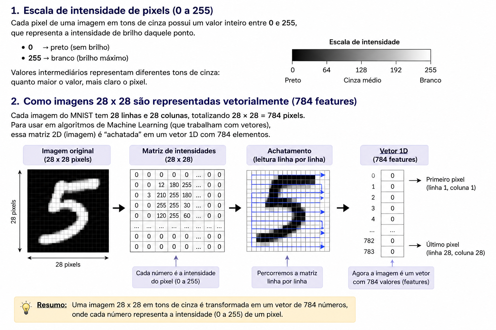

# Classificação de Dígitos Manuscritos: Comparação de Modelos e Análise de Class Masking, OOD e Overconfidence

Classificação de dígitos manuscritos (MNIST) com comparação entre KNN, Random Forest e MLP, incluindo experimentos de **Class Masking**, **OOD (Out-of-Distribution)** e **Overconfidence**, além de uma aplicação Streamlit para inferência em imagens manuscritas próprias.


## Escopo

- Treino e avaliação comparativa de 3 modelos (KNN, Random Forest, MLP) no MNIST.
- Testes de robustez:
  - **Class masking**: treino do MLP sem as classes 4 e 7, avaliação da acurácia e
    da confiança do modelo ao classificar essas classes nunca vistas.
  - **Inferência OOD**: avaliação do modelo em entradas fora da distribuição de treino.
  - **Imagens manuscritas próprias**: pipeline de pré-processamento (escala de cinza,
    remoção de sombra, limiar de Otsu, centralização por bounding box/centro de massa)
    para classificar fotos e desenhos próprios, fora do formato do MNIST.
- Aplicação web (Streamlit) que carrega os 3 modelos treinados, classifica imagens
  submetidas e reporta o voto por maioria entre eles.

## Técnicas e tecnologias utilizadas

- **Linguagem**: Python 3.9
- **Modelos** (`scikit-learn`): KNN, Random Forest e MLP (rede neural), com busca de
  hiperparâmetros via `GridSearchCV`
- **Pré-processamento de imagem**: `Pillow`, `scikit-image` (limiar de Otsu),
  `scipy.ndimage` (remoção de sombra, centralização por centro de massa/bounding box)
- **Dataset**: [MNIST](https://www.kaggle.com/datasets/hojjatk/mnist-dataset/data) — carregado via `fetch_openml` (`sklearn.datasets`)
- **Notebook**: Jupyter (`mnist.ipynb`) — EDA, treino, avaliação e experimentos
- **App**: Streamlit
- **Containerização**: Docker + Docker Compose




## Estrutura do projeto

```
.
├── mnist.ipynb              # notebook principal: EDA, treino, avaliação, experimentos
├── requirements.txt         # dependências do notebook
│
├── src/                       # código do notebook, em módulos
│   ├── data.py                # carregamento do MNIST
│   ├── eda.py                 # análise exploratória
│   ├── preprocessing.py       # split, normalização, remoção/seleção de classes
│   ├── models.py              # criação e busca de hiperparâmetros dos 3 modelos
│   ├── model_cache.py         # cache de hiperparâmetros + salvar modelo/métricas
│   ├── evaluation.py          # métricas, tabela comparativa, conclusão técnica
│   ├── visualize.py           # plotagem de gráficos (salvos em outputs/figures/)
│   └── manuscript.py          # pipeline de pré-processamento de fotos próprias
│
├── config/
│   ├── config.py                        # caminhos e constantes centralizados do projeto
│   └── melhores_hiperparametros.json    # cache gerado pelo GridSearchCV
│
├── models/                    # modelos treinados (gerado pelo notebook, .pkl)
│   ├── knn/, random_forest/, mlp/       # modelo + metricas.json de cada um
│   └── mlp_class_masking/               # experimento da Fase 5.1
│
├── outputs/figures/           # saídas geradas pelo notebook (gráficos/imagens)
├── my_images/                 # fotos próprias para teste (light/ = fundo claro, dark/ = fundo escuro)
├── images/                    # imagens usadas na documentação/notebook
│
├── app/                       # aplicação web (Streamlit)
│   ├── app.py                 # interface
│   ├── predictor.py           # carregamento dos modelos, detecção de orientação, votação
│   ├── models/                # modelos copiados do notebook (usados pelo app)
│   └── requirements.txt       # dependências só do app
│
├── Dockerfile
├── docker-compose.yml
└── .dockerignore
```

## Como executar

### 1. Treinar os modelos (necessário antes de tudo)

```bash
python3 -m venv venv
source venv/bin/activate
pip install -r requirements.txt
```

Abra e rode `mnist.ipynb` até o fim — pelo VS Code (extensão Jupyter), JupyterLab
ou `jupyter notebook` (esses dois últimos exigem instalar `pip install notebook`
ou `jupyterlab` à parte, não incluídos no `requirements.txt`). Isso baixa o MNIST,
treina os 3 modelos e salva os `.pkl` em `models/` e `app/models/`.

### 2. Rodar o app

**Via Docker (recomendado):**

```bash
docker compose up --build
```

**Ou direto no venv, sem Docker:**

```bash
source venv/bin/activate
pip install -r app/requirements.txt
streamlit run app/app.py
```

Nos dois casos, acesse **http://localhost:8501** e envie uma imagem de dígito.

Os modelos em `app/models/` são montados como volume no `docker-compose.yml`: ao
retreinar no notebook, o app passa a usar os modelos novos automaticamente, sem
precisar reconstruir a imagem Docker.

## Possíveis melhorias futuras

- Aumentar o conjunto de fotos próprias de teste, com mais variação de caneta, papel e iluminação
- Adicionar um mecanismo de rejeição (o modelo dizer "não sei" em vez de forçar uma classe) para os casos de entrada fora da distribuição
- Suportar múltiplos dígitos na mesma imagem (hoje o pipeline assume um único dígito por foto)


## Demonstração

[Vídeo de demonstração](URL_AQUI)